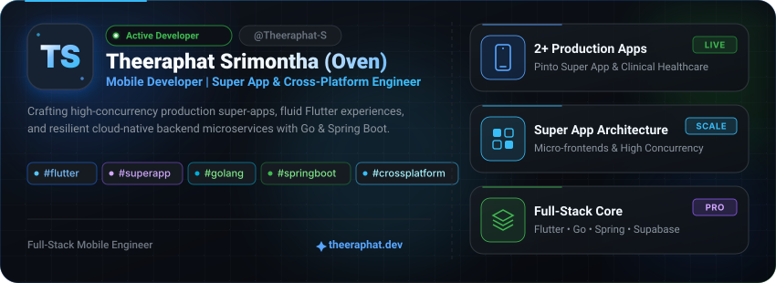

<!-- Header -->

  
  
  

 

---

## 🚀 Flagship Production Projects

| Project                                                                                                                                                                                    | Overview & Architecture                                                                                                                                                                                  | Platform & Links                                                                                                                                                                                                                                                                                                                                                                                                                                                                                                                                                                                                                                                                                                                                                                |
| :----------------------------------------------------------------------------------------------------------------------------------------------------------------------------------------- | :------------------------------------------------------------------------------------------------------------------------------------------------------------------------------------------------------- | :------------------------------------------------------------------------------------------------------------------------------------------------------------------------------------------------------------------------------------------------------------------------------------------------------------------------------------------------------------------------------------------------------------------------------------------------------------------------------------------------------------------------------------------------------------------------------------------------------------------------------------------------------------------------------------------------------------------------------------------------------------------------------ |
|  **Pinto App** Fakduai Digital Platform | **Production Super App Platform** An on-demand super app connecting multi-service workflows, food ordering, and merchant platforms in a unified mobile ecosystem.                                |                                                                                                                                                                                                                                                                                                                                                                               |
|  **NCD Screening**                                          | **Mobile Clinical Risk-Assessment Tool** Specialized healthcare screening application for 4 chronic Non-Communicable Diseases, featuring guided diagnosis flows and clinical record management.  | [](https://github.com/Theeraphat-S/Theeraphat-S/blob/main/SRS_%E0%B9%81%E0%B8%AD%E0%B8%9B%E0%B8%9E%E0%B8%A5%E0%B8%B4%E0%B9%80%E0%B8%84%E0%B8%8A%E0%B8%B1%E0%B8%99%E0%B8%81%E0%B8%B2%E0%B8%A3%E0%B8%84%E0%B8%B1%E0%B8%94%E0%B8%81%E0%B8%A3%E0%B8%AD%E0%B8%87%E0%B8%84%E0%B8%A7%E0%B8%B2%E0%B8%A1%E0%B9%80%E0%B8%AA%E0%B8%B5%E0%B9%88%E0%B8%A2%E0%B8%87%E0%B8%82%E0%B8%AD%E0%B8%87%E0%B8%9C%E0%B8%B9%E0%B9%89%E0%B8%9B%E0%B9%88%E0%B8%A7%E0%B8%A2%204%20%E0%B9%82%E0%B8%A3%E0%B8%84%E0%B9%84%E0%B8%A1%E0%B9%88%E0%B8%95%E0%B8%B4%E0%B8%94%E0%B8%95%E0%B9%88%E0%B8%AD%E0%B9%80%E0%B8%A3%E0%B8%B7%E0%B9%89%E0%B8%AD%E0%B8%A3%E0%B8%B1%E0%B8%87.pdf) |

---

## 🛠️ Technical Arsenal

### Languages

 

### Frontend & Cross-Platform

 

### Backend & Cloud

 

### Database

 

### Tools & Platforms

 

### Others & Social

---

## 📈 GitHub Stats

<table align="center" width="100%">
  <tr>
    <td width="33.3%" align="center" valign="middle">
      
    </td>
    <td width="33.3%" align="center" valign="middle">
      
    </td>
    <td width="33.3%" align="center" valign="middle">
      
    </td>
  </tr>
</table>

---

## 📉 Contribution Graph

  

---

## 📊 GitHub Analytics & Activity

<table align="center" width="100%">
  <tr>
    <td width="50%" align="center" valign="top">
      
    </td>
    <td width="50%" align="center" valign="top">
      
    </td>
  </tr>
</table>

<!-- Footer -->

